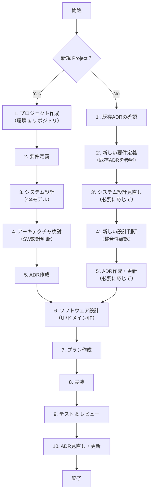

# 0. 全体フロー


# 1. ClaudeCodeを使う際の便利なコマンド
## 1.1. メモリ更新
1. `#` でメモリモード  
2. `1. Project memory`  
3. `Claude.md` 更新  

## 1.2 コンテキスト管理
大量にやり取りをすると、Claudeのコンテキストが増加し品質低下を起こす。その際は下記の2コマンドを検討する
```claude
/clear
/compact
```
## 1.3 カスタムコマンド作成
下記のように`.claude/commands`にmd形式でコマンドを作成依頼できる。Claudeの再起動後はコマンドが反映される。

```claude
ruff, mypy, pytest を利用した品質チェック手順を
.claude/commands/quality-fix.md にまとめてください
```
## 1.4 Claudeのメモリ管理
下記のように`.claude`配下にmdを置いてClaudeのプロジェクト起動の読み込みメモリを追加できる。
```md
- .claude/ard.md             : Requirementルール
- .claude/ard.md             : ADRルール

```
