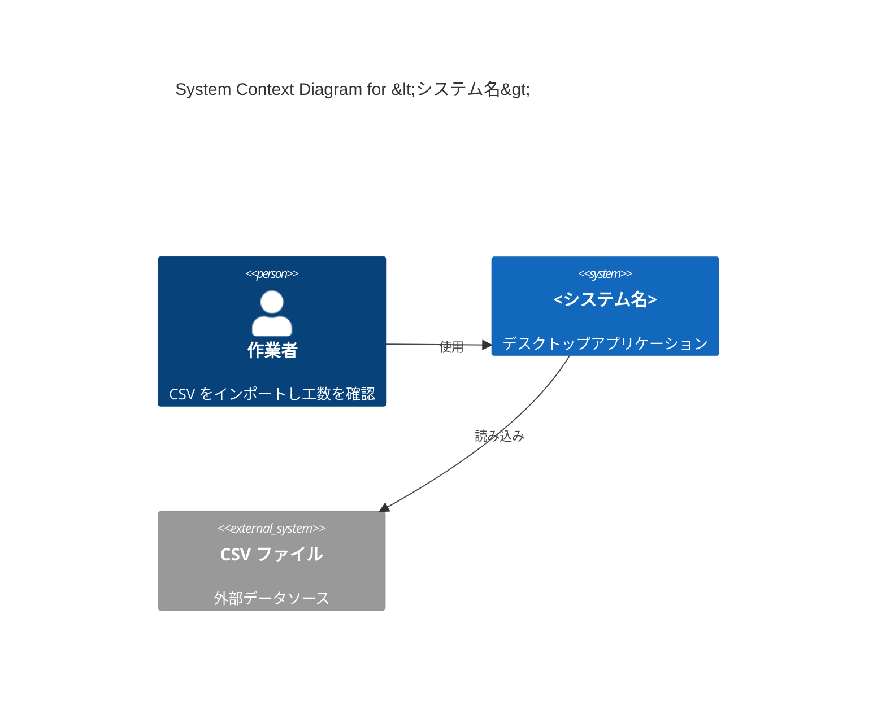
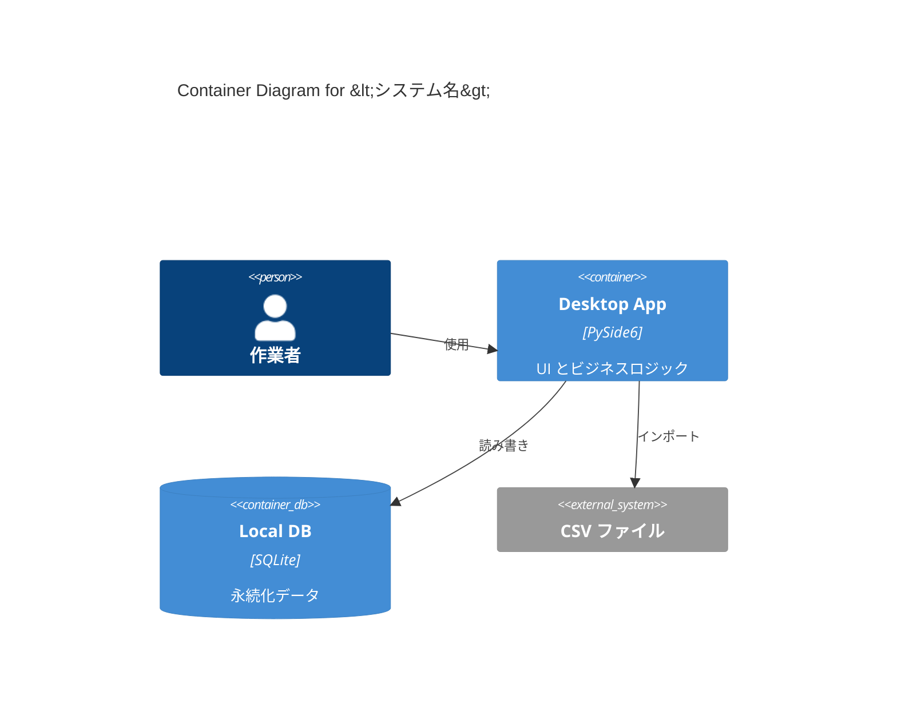
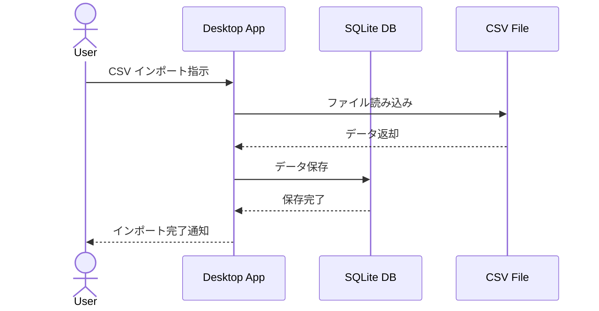

# システム設計（C4モデルベース）

## 目的
- `docs/requirements/02_system-requirements.md`（要件定義書）を前提に、
  **システム全体の構成をC4モデルで可視化し、システムレベルの設計判断を行う**。
- 複数のハードウェア、外部システム、サブシステムが関係する場合に、
  **System Context（レベル1）とContainer（レベル2）を明確化**し、
  後続の「アーキテクチャ検討（ソフトウェアレベル）」へ橋渡しする。
- 単体アプリケーションの場合でも、外部依存や配置構成を整理し、
  全体像を可視化することで設計の抜け漏れを防ぐ。

このコマンドは **「システム全体の構造と境界を定義するフェーズ」** を担い、
個別のソフトウェアアーキテクチャ（レイヤード、DDD等）の検討は
次フェーズ「4. アーキテクチャ検討」で行う前提とする。

---

## 入力

必ず以下のファイルを前提とすること：

- `docs/requirements/02_system-requirements.md`
- 必要に応じて：
  - `docs/requirements/01_stakeholder-needs.md`

追加で、ユーザーから以下のような補足を受け取ってもよい：

- ハードウェア構成（組込み機器、センサー、制御装置など）
- 外部システム連携（他社システム、クラウドサービス、APIなど）
- 配置環境（オンプレミス、クラウド、エッジ、ハイブリッドなど）
- ネットワーク構成・セキュリティ境界
- 運用形態（24時間稼働、バッチ処理、リアルタイム応答など）

入力例：

```
docs/requirements/02_system-requirements.md を前提に、
システム設計書を作成してください。

【補足】
- クライアントPC上で動作するデスクトップアプリ
- 外部システム：なし（CSVファイル入力のみ）
- DB：SQLite（ローカル）
```

---

## 出力

`docs/design/00_system-design.md` を生成する。
構造は以下の **固定テンプレート** に従うこと。

**見出し構造（#, ##, ###）は絶対に変更してはならない。**

---

# <システム名> System Design

## 1. Overview（概要）

以下の観点を **02_system-requirements.md をベースに簡潔に要約**する：

### システムの目的
- このシステムが解決する課題、提供する価値を 2〜4 行でまとめる。
- Overview / System Summary 等から抽出。

### 対象範囲（含む／含まないもの）
- **含むもの**：このシステムが提供する機能・サービスを箇条書き。
- **含まないもの**：明示的にスコープ外とするもの（将来対応予定含む）を箇条書き。

### 関連する要求定義書・要件定義書・ADR
- `docs/requirements/01_stakeholder-needs.md`
- `docs/requirements/02_system-requirements.md`
- （後続フェーズで作成される ADR への参照は、ADR 作成後に追記可能）

---

## 2. System Context（コンテキスト）

C4モデルの **レベル1（System Context）** に相当。
システムと外部アクター・外部システムの関係を明示する。

### 外部アクター（ユーザ、他システム、デバイス）
- **人間のアクター**：エンドユーザー、管理者、オペレーターなど
- **システムアクター**：外部API、他社システム、クラウドサービス、ハードウェア機器など
- 各アクターの役割と、システムとのやり取りの概要を記述。

例：

| アクター | 種別 | 役割 |
|---------|------|------|
| 作業者（ユーザー） | 人間 | CSV をインポートし、工数チャートを確認する |
| CSV ファイル | 外部データ | 日別工数データの入力元 |
| SQLite DB | 内部データストア | 永続化されたデータの保存先 |

### 外部システム一覧と役割
- 外部システムが存在する場合、その一覧と役割を記述。
- 単体アプリの場合は「外部システムなし」でもよい。

### C4 System Context 図（信頼境界を明示）

Mermaid または PlantUML で **System Context 図**を記述する。

- システムの境界を明示
- 外部アクター・外部システムとの関係を矢印で表現
- 必要に応じて信頼境界（Trust Boundary）を明示

例（Mermaid）：



---

## 3. Quality Attributes & Constraints（非機能／制約）

`docs/requirements/02_system-requirements.md` の非機能要件から、
**システムレベルで重視すべき品質特性と制約**を抽出する。

### 性能・可用性・セキュリティ・運用など主要な品質シナリオ
- Performance：応答時間、スループット、バッチ処理時間など
- Availability：稼働率、障害復旧時間など
- Security：認証、認可、データ暗号化、監査ログなど
- Usability：ユーザビリティ、アクセシビリティなど
- Operability：運用監視、ログ管理、バックアップなど

例：

| 品質特性 | 要求 | 関連 REQ-NF |
|---------|------|-------------|
| Performance | 主要画面の応答時間 3 秒以内 | REQ-NF-001 |
| Availability | 平日日中 99% 稼働 | REQ-NF-002 |
| Security | ローカルデータのみ、外部通信なし | REQ-NF-005 |

### プラットフォーム制約（OS, ランタイム, 言語, DB 等）
- 対象OS：Windows 10/11、macOS、Linux など
- ランタイム：Python 3.11+、.NET 8、JVM など
- 言語：Python、C#、Java など
- DB：SQLite、PostgreSQL、MySQL など
- その他：ライブラリ、フレームワーク、ミドルウェアの制約

### 組織・運用上の制約（導入可能なツール、権限など）
- チームスキル：Python経験者のみ、など
- 導入制約：オープンソースのみ、ライセンス制約など
- 運用制約：自動デプロイ不可、手動インストールのみ、など

---

## 4. Logical Architecture（論理アーキテクチャ）

C4モデルの **レベル2（Container）** に相当。
システムを構成するサブシステム／コンポーネント（アプリ、サービス、ライブラリ）を明示する。

### サブシステム／コンポーネント（アプリ、サービス、ライブラリ）の一覧
- 各コンテナの名称、役割、技術スタックを記述。

例：

| コンテナ名 | 種別 | 役割 | 技術スタック |
|-----------|------|------|-------------|
| Desktop App | アプリケーション | UI とビジネスロジックを提供 | PySide6, Python 3.11 |
| Local DB | データストア | 永続化データを保存 | SQLite |
| CSV Parser | ライブラリ | CSV ファイルの読み込み・検証 | Python標準ライブラリ |

### C4 Container 図
- Mermaid または PlantUML で **Container 図**を記述。
- 各コンテナ間のデータフロー、依存関係を矢印で表現。

例（Mermaid）：



### 各コンテナの役割と責務
- 各コンテナが担当する機能、責務を明記。
- レイヤー構造（Presentation / Application / Domain / Infrastructure）は
  **次フェーズ「4. アーキテクチャ検討」で詳細化**する前提でよい。

---

## 5. Execution / Deployment View（実行・配置）

システムの実行環境と配置構成を記述する。

### 実行環境（クライアントPC、サーバ、クラウドなど）
- 物理的な配置先を明示。
- オンプレミス、クラウド、エッジ、ハイブリッド構成など。

例：
- クライアントPC（Windows 10/11）上でスタンドアロン実行
- クラウド（AWS EC2）上で API サーバーとして稼働
- エッジデバイス（Raspberry Pi）上でセンサーデータ収集

### プロセス／サービスの構成
- 実行時のプロセス構成、サービス間通信を記述。
- 単一プロセス、マルチプロセス、分散システムなど。

### 外部ランタイム・ミドルウェアとの関係
- 必要なランタイム（Python、.NET、JVMなど）
- ミドルウェア（Webサーバー、メッセージキュー、キャッシュなど）

---

## 6. Integration & Data Flow（連携とデータフロー）

外部システムとのインターフェース、システム内のデータフローを記述する。

### 外部システムとのインターフェース仕様の概要
- 外部システムが存在する場合、連携方式（REST API、gRPC、ファイル連携など）を記述。
- 認証・認可方式、データフォーマット（JSON、XML、CSVなど）を明示。

### 代表的なエンドツーエンドシナリオのデータ流れ
- 主要なユースケースについて、データの流れを記述。
- Mermaid sequenceDiagram などで可視化してもよい。

例：



---

## 7. Mapping to Requirements（要件への対応）

システムレベルで、要件定義書の REQ-F / REQ-NF に対応する設計要素を明示する。

### REQ-F / REQ-NF への対応マトリクス（システムレベル）

例：

| 要件ID | 要件概要 | 対応するコンテナ／コンポーネント | 備考 |
|--------|----------|--------------------------------|------|
| REQ-F-001 | CSV インポート機能 | Desktop App, CSV Parser | |
| REQ-F-002 | データ永続化 | Local DB (SQLite) | |
| REQ-NF-001 | 応答時間 3 秒以内 | Desktop App | UIスレッド分離で対応 |
| REQ-NF-005 | オフライン動作 | Desktop App, Local DB | 外部通信なし |

### 未対応・グレーな要件の明示
- 要件定義書に記載されているが、システム設計で未対応の要件を明示。
- 理由（将来対応、スコープ外、技術的制約など）を記述。

---

## 8. Risks & Future（システムレベルのリスク・将来方針）

システム全体としてのリスク、将来の拡張方針を記述する。

### 全体構成としてのリスク
- 単一障害点（SPOF）の存在
- スケーラビリティの限界
- セキュリティリスク（認証なし、暗号化なしなど）
- 運用リスク（監視なし、バックアップなしなど）

### 将来的な拡張ポイント
- マルチテナント化、クラウド移行、マイクロサービス化など
- 外部システム連携の追加、API公開など
- モバイル対応、Web化など

---

## 禁止事項

- `docs/requirements/02_system-requirements.md` の内容や構造を勝手に変更しないこと。
- STK / REQ-F / REQ-NF の ID を再定義・再採番しないこと。
- 見出し構造（#, ##, ###）を変更・追加・削除しないこと。
- **ソフトウェアアーキテクチャ（レイヤード、DDD等）の詳細検討はこのフェーズでは行わない**。
  それは次フェーズ「4. アーキテクチャ検討」で扱う。

---

## 成果物

- `docs/design/00_system-design.md`（凍結済み）
  - 次フェーズ「4. アーキテクチャ検討」の入力となる
