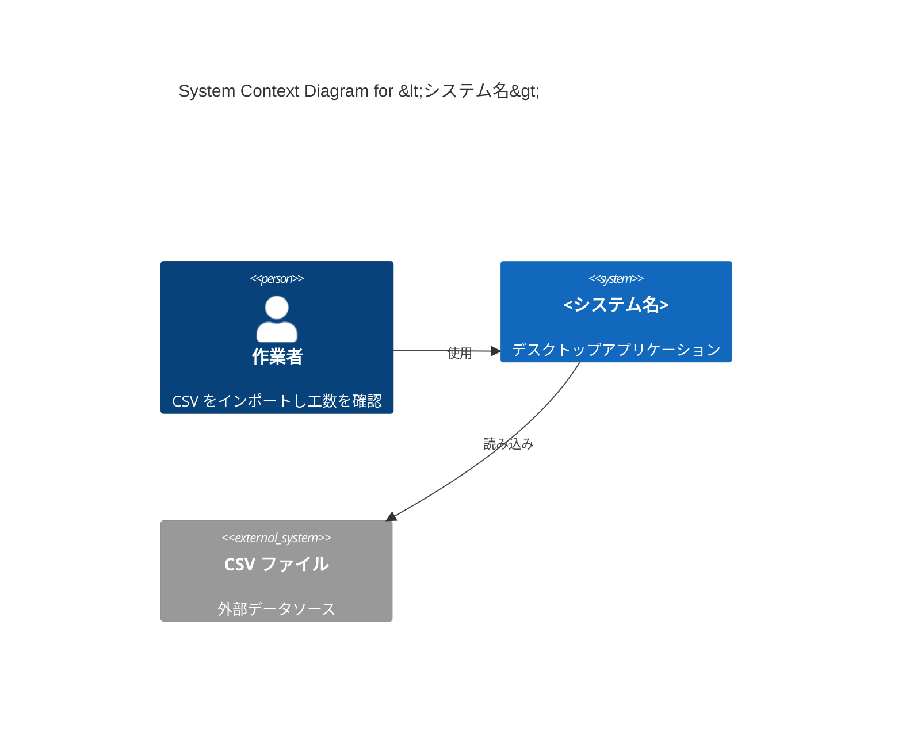
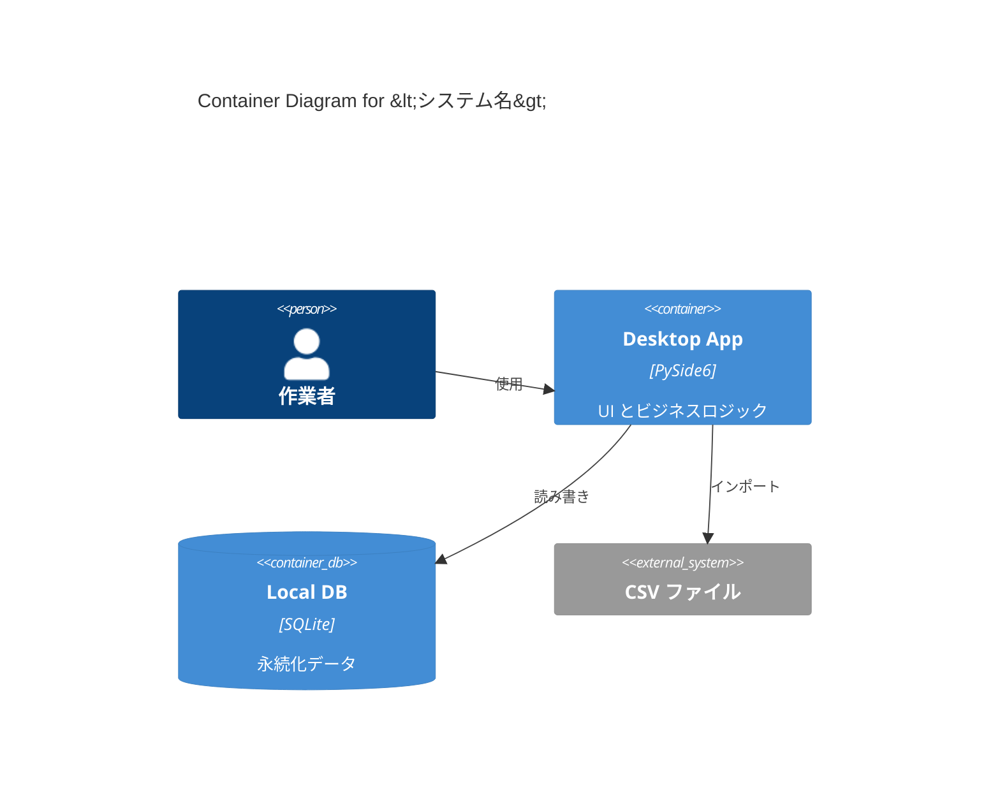
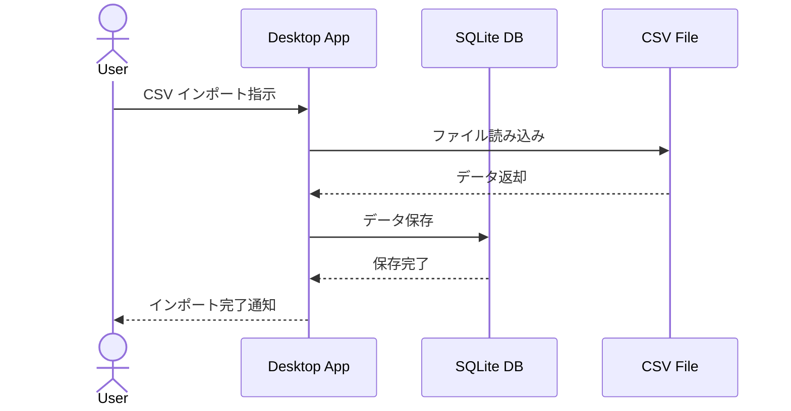

# システム設計書 作成プロセス定義書
（00_system-design.md の正式運用ルール）

本書は以下を目的とする。

1. 要件定義で得た情報を **システム全体の構造と境界** として可視化する
2. C4モデル（System Context / Container）を用いて **外部システム・ハードウェアを含む全体像** を明確にする
3. ソフトウェアアーキテクチャ検討の前に **システムレベルの設計判断** を完了させる
4. 複数のハードウェア・外部システムが関係する場合でも **一貫した粒度と品質** で設計できるようにする

---

# 0. 固定テンプレート構造（厳守）

システム設計書は以下の **8つの章** で構成される。
**見出し構造（#, ##, ###）は絶対に変更してはならない。**

```
1. Overview（概要）
2. System Context（コンテキスト）
3. Quality Attributes & Constraints（非機能／制約）
4. Logical Architecture（論理アーキテクチャ）
5. Execution / Deployment View（実行・配置）
6. Integration & Data Flow（連携とデータフロー）
7. Mapping to Requirements（要件への対応）
8. Risks & Future（システムレベルのリスク・将来方針）
```

参照：`手作業/テンプレート/システム設計書.md`

---

# 1. プロセス全体フロー（厳守）

システム設計書の各章を以下の順序で作成する。

1. **要件定義書の精読**（Purpose / REQ-F / REQ-NF / Constraints の再確認）
2. **1. Overview の作成**（システムの目的・範囲・関連ドキュメント）
3. **2. System Context の作成**（外部アクター・外部システム・Context図）
4. **3. Quality Attributes & Constraints の作成**（品質特性と制約の整理）
5. **4. Logical Architecture の作成**（Container図、各コンテナの役割）
6. **5. Execution / Deployment View の作成**（実行環境・配置）
7. **6. Integration & Data Flow の作成**（外部連携・データフロー）
8. **7. Mapping to Requirements の作成**（要件への対応確認）
9. **8. Risks & Future の作成**（システムレベルのリスク分析）
10. **レビュー**（ステークホルダー整合 / アーキテクト観点レビュー）

工程を飛ばしてはならない。
特に **System Context の曖昧さとデータフローの手抜きは後工程の大きな手戻りの原因**。

---

# 2. 【テンプレート 1. Overview】 作成プロセス

## 2.1 入力
- `02_system-requirements.md` の Overview
- Purpose と Scope
- 主要な REQ-F（機能要件）

## 2.2 作成手順

テンプレートの **1. Overview** を埋める。

### 1.1 システムの目的
1. 要件定義書の Purpose を読み、システム全体が解決する課題を 2〜4 行で要約
2. **「なぜこのシステムが必要か」** を明確にする
3. 技術的な詳細（DB、言語など）は書かない

### 1.2 対象範囲（含む／含まないもの）
1. **含むもの**: システムが提供する機能・サービスを箇条書き
   - 要件定義の REQ-F を参照
   - サブシステム・コンポーネント単位で列挙
2. **含まないもの**: 明示的にスコープ外とするものを箇条書き
   - 将来対応予定のものも含む
   - Out of Scope が曖昧だと後工程で混乱する

### 1.3 関連する要求定義書・要件定義書・ADR
- `docs/requirements/01_stakeholder-needs.md`
- `docs/requirements/02_system-requirements.md`
- （ADR は後続フェーズで作成されるため、この時点では未参照でよい）

## 2.3 禁止事項
- ソフトウェアアーキテクチャ（レイヤード、DDD等）を書く
- 技術選定（言語、FW、DB）を先行して決める
- 詳細設計レベルの情報を書く

---

# 3. 【テンプレート 2. System Context】 作成プロセス

## 3.1 入力
- 02_system-requirements.md の全 REQ-F
- 3. Stakeholder List
- 5. Constraints（技術制約・外部システム制約）

## 3.2 作成手順

テンプレートの **2. System Context** を埋める。

### 2.1 外部アクター（ユーザ、他システム、デバイス）

#### 洗い出し対象
以下をすべて「外部アクター」として抽出する。

| タイプ | 例 |
|-------|----|
| 人間のアクター | エンドユーザー、管理者、オペレーター、保守担当者 |
| システムアクター | 外部API、他社システム、クラウドサービス、ハードウェア機器 |
| 外部データソース | CSV ファイル、JSON ファイル、外部DB |

#### 記述形式
表形式で記述する。

```markdown
| アクター | 種別 | 役割 |
|---------|------|------|
| 作業者（ユーザー） | 人間 | CSV をインポートし、工数チャートを確認する |
| CSV ファイル | 外部データ | 日別工数データの入力元 |
| SQLite DB | 内部データストア | 永続化されたデータの保存先 |
```

### 2.2 外部システム一覧と役割
- 外部システムが存在する場合、その一覧と役割を記述
- 単体アプリの場合は「外部システムなし」でもよい

### 2.3 C4 System Context 図（信頼境界を明示）

#### 使用ツール
- Mermaid（推奨）
- PlantUML
- draw.io

#### 記述ルール
1. **システムを中央に配置**
2. **外部アクターを周辺に配置**
3. **矢印で関係性を表現**（データフロー、制御フロー）
4. **信頼境界を明示**（点線、色分けなど）

#### 例（Mermaid）


---

# 4. 【テンプレート 3. Quality Attributes & Constraints】 作成プロセス

## 4.1 入力
- 02_system-requirements.md の Non-Functional Requirements
- 5. Constraints（技術制約・運用制約）

## 4.2 作成手順

テンプレートの **3. Quality Attributes & Constraints** を埋める。

### 3.1 性能・可用性・セキュリティ・運用など主要な品質シナリオ

#### ISO 25010 による分類
以下のカテゴリから、システムに関連するものを抽出する。

| 品質特性 | 記述例 |
|---------|--------|
| Performance | 主要画面の応答時間 3 秒以内 |
| Availability | 平日日中 99% 稼働 |
| Security | ローカルデータのみ、外部通信なし |
| Usability | 操作習熟期間 1 日以内 |
| Operability | 日次自動バックアップ |

#### 記述ルール
1. **必ず定量化する**（速度、件数、時間、率など）
2. **曖昧語（"迅速に""スムーズに"）は禁止**
3. **要件定義の REQ-NF を参照し、システムレベルに昇華する**

#### 記述形式
```markdown
| 品質特性 | 要求 | 関連 REQ-NF |
|---------|------|-------------|
| Performance | 主要画面の応答時間 3 秒以内 | REQ-NF-001 |
| Availability | 平日日中 99% 稼働 | REQ-NF-002 |
| Security | ローカルデータのみ、外部通信なし | REQ-NF-005 |
```

### 3.2 プラットフォーム制約（OS, ランタイム, 言語, DB 等）
- 対象OS、ランタイム、言語、DB、その他ライブラリ・フレームワーク・ミドルウェアの制約を記述

### 3.3 組織・運用上の制約（導入可能なツール、権限など）
- チームスキル、導入制約、運用制約などを記述
- **「情報不足」を空欄にしない**。必ず「情報不足、要確認（理由）」と記載する

---

# 5. 【テンプレート 4. Logical Architecture】 作成プロセス

## 5.1 入力
- System Context 図（外部システムとの関係）
- 要件定義の REQ-F（機能要件）
- Quality Attributes（品質特性）

## 5.2 作成手順

テンプレートの **4. Logical Architecture** を埋める。

### 4.1 サブシステム／コンポーネント（アプリ、サービス、ライブラリ）の一覧

#### 洗い出し基準
以下をすべて「Container（コンテナ）」として抽出する。

| タイプ | 例 |
|-------|----|
| アプリケーション | Desktop App、Web App、Mobile App |
| データストア | Local DB、Cache、File Storage |
| ライブラリ | CSV Parser、PDF Generator |
| バッチ処理 | Data Migration Batch、Report Generation Batch |

#### 記述形式
表形式で記述する。

```markdown
| コンテナ名 | 種別 | 役割 | 技術スタック |
|-----------|------|------|-------------|
| Desktop App | アプリケーション | UI とビジネスロジックを提供 | PySide6, Python 3.11 |
| Local DB | データストア | 永続化データを保存 | SQLite |
| CSV Parser | ライブラリ | CSV ファイルの読み込み・検証 | Python 標準ライブラリ |
```

### 4.2 C4 Container 図

#### 使用ツール
- Mermaid（推奨）
- PlantUML

#### 記述ルール
1. **各コンテナの名称、役割、技術スタックを明示**
2. **コンテナ間のデータフロー・依存関係を矢印で表現**
3. **外部システムとの接続点を明確化**

#### 例（Mermaid）


### 4.3 各コンテナの役割と責務
- 各コンテナが担当する機能、責務を簡潔に記述
- **レイヤー構造（Presentation / Application / Domain / Infrastructure）は次フェーズ「アーキテクチャ検討」で詳細化**

---

# 6. 【テンプレート 5. Execution / Deployment View】 作成プロセス

## 6.1 入力
- Container 図（コンテナ構成）
- Constraints（プラットフォーム制約、運用制約）

## 6.2 作成手順

テンプレートの **5. Execution / Deployment View** を埋める。

### 5.1 実行環境（クライアントPC、サーバ、クラウドなど）
- 物理的な配置先を明示（クライアントPC、サーバ、クラウド、エッジ）

### 5.2 プロセス／サービスの構成
- 実行時のプロセス構成（単一プロセス、マルチプロセス、分散システム）

### 5.3 外部ランタイム・ミドルウェアとの関係
- 必要なランタイム（Python、.NET、JVMなど）
- ミドルウェア（Webサーバー、メッセージキュー、キャッシュなど）

#### 記述例
```markdown
#### 実行環境
- クライアントPC（Windows 10/11）上でスタンドアロン実行

#### プロセス構成
- 単一プロセス（Desktop App）
- UIスレッドとバックグラウンドスレッドで構成

#### 外部ランタイム
- Python 3.11+ ランタイムが必要
- SQLite は Python 標準ライブラリに含まれる
```

---

# 7. 【テンプレート 6. Integration & Data Flow】 作成プロセス

## 7.1 入力
- System Context 図（外部システムとの関係）
- Container 図（内部コンテナ構成）
- 要件定義の REQ-F（特にデータ連携に関する要件）

## 7.2 作成手順

テンプレートの **6. Integration & Data Flow** を埋める。

### 6.1 外部システムとのインターフェース仕様の概要

#### 記述形式
```markdown
| 外部システム | 連携方式 | データフォーマット | 認証方式 | 備考 |
|-------------|---------|-------------------|---------|------|
| CSV ファイル | ファイル読み込み | CSV（UTF-8, Shift-JIS） | なし | ローカルファイルシステム |
```

### 6.2 代表的なエンドツーエンドシナリオのデータ流れ

#### シーケンス図の作成（Mermaid 推奨）
主要なユースケースについて、データの流れを可視化する。



#### 注意点
- **データの流れる方向を明確にする**
- **エラーハンドリングの概要も記述**
- **Single Source of Truth（データの正の源泉）を明示**

---

# 8. 【テンプレート 7. Mapping to Requirements】 作成プロセス

## 8.1 入力
- 02_system-requirements.md の全 REQ-F / REQ-NF
- Container 図（コンテナ構成）

## 8.2 作成手順

テンプレートの **7. Mapping to Requirements** を埋める。

### 7.1 REQ-F / REQ-NF への対応マトリクス（システムレベル）

#### 記述形式
```markdown
| 要件ID | 要件概要 | 対応するコンテナ／コンポーネント | 備考 |
|--------|----------|--------------------------------|------|
| REQ-F-001 | CSV インポート機能 | Desktop App, CSV Parser | |
| REQ-F-002 | データ永続化 | Local DB (SQLite) | |
| REQ-NF-001 | 応答時間 3 秒以内 | Desktop App | UI スレッド分離で対応 |
```

### 7.2 未対応・グレーな要件の明示

#### 記述形式
```markdown
| 要件ID | 要件概要 | 未対応の理由 | 対応予定 |
|--------|----------|-------------|---------|
| REQ-F-015 | レポート自動送信 | Phase 2 対応予定 | 次期リリース |
```

#### トレーサビリティの保証
1. **すべての REQ-F / REQ-NF が少なくとも 1 つのコンテナに対応している**
2. **対応していない要件は「未対応」として明示**
3. **未対応の理由を記述**

---

# 9. 【テンプレート 8. Risks & Future】 作成プロセス

## 9.1 入力
- Container 図（コンテナ構成）
- Deployment View（配置環境）
- Quality Attributes（品質特性）

## 9.2 作成手順

テンプレートの **8. Risks & Future** を埋める。

### 8.1 全体構成としてのリスク

#### 抽出すべきリスク
| リスクカテゴリ | 例 |
|---------------|-----|
| 単一障害点（SPOF） | DB が単一障害点、バックアップなし |
| スケーラビリティ | 同時ユーザー数の上限、データ量の上限 |
| セキュリティ | 認証なし、暗号化なし、外部通信の脆弱性 |
| 運用 | 監視なし、ログ不足、復旧手順なし |

#### 記述形式
```markdown
1. **SPOF**: Local DB が単一障害点。データ破損時の復旧手順が未整備
   - **軽減策**: 定期バックアップの自動化、復旧手順書の整備
2. **スケーラビリティ**: SQLite は同時書き込みに弱い
   - **軽減策**: 単一ユーザー専用とする、マルチユーザー対応は Phase 2
```

### 8.2 将来的な拡張ポイント

#### 記述形式
```markdown
1. **クラウド対応**: データバックアップをクラウドストレージに対応（Phase 2）
2. **マルチユーザー対応**: PostgreSQL への移行を検討（Phase 3）
```

---

# 10. レビュー手順

## 10.1 ステークホルダー向けレビュー
- System Context 図が理解しやすいか
- 外部システムとの関係が正しく表現されているか
- データフローが業務フローと一致しているか

## 10.2 アーキテクト向けレビュー
- Container 図が妥当か
- Quality Attributes が現実的か
- Deployment View が実現可能か
- リスク分析が十分か

## 10.3 要件整合性レビュー
- すべての REQ-F / REQ-NF が対応しているか
- 未対応要件の理由が明確か
- トレーサビリティが保証されているか

---

# 11. 最終チェックリスト（必須）

- [ ] **1. Overview** が完備されているか
- [ ] **2. System Context** 図がすべての外部アクター・外部システムを含んでいるか
- [ ] **3. Quality Attributes** が定量化されているか
- [ ] **4. Container** 図がすべてのサブシステム・コンポーネントを含んでいるか
- [ ] **5. Deployment View** が具体的に記述されているか
- [ ] **6. Data Flow** がエンドツーエンドで追跡可能か
- [ ] **7. Mapping to Requirements** がすべての REQ-F / REQ-NF をカバーしているか
- [ ] **8. Risks & Future** が分析されているか
- [ ] ソフトウェアアーキテクチャの詳細（レイヤード、DDD等）は含まれていないか

---

# 付録：作業の入力と出力

## 入力
```
docs/requirements/02_system-requirements.md
```

## 出力
```
docs/design/00_system-design.md
```

## テンプレート構造
```
手作業/テンプレート/システム設計書.md
```

---

# まとめ（重要ポイント）

- システム設計書は **固定テンプレート（8章）** に従う
- テンプレートの見出し構造（#, ##, ###）は **絶対に変更してはならない**
- C4モデルを用いて **System Context（レベル1）と Container（レベル2）** を可視化する
- ソフトウェアアーキテクチャ（レイヤード、DDD等）の詳細検討は **次フェーズ「アーキテクチャ検討」** で行う
- **データフローと配置環境** を明確にすることで、後工程の手戻りを最小化する
- **トレーサビリティ** を保証し、すべての要件がシステム設計に反映されていることを確認する
