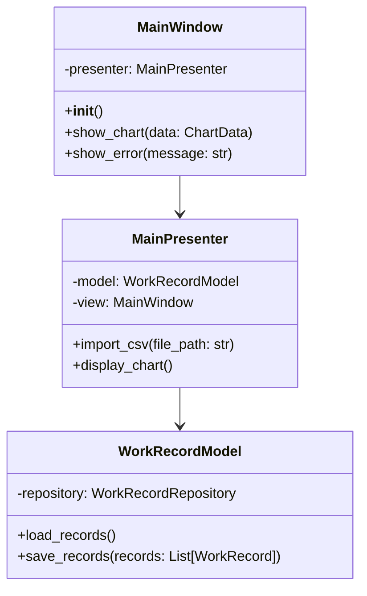
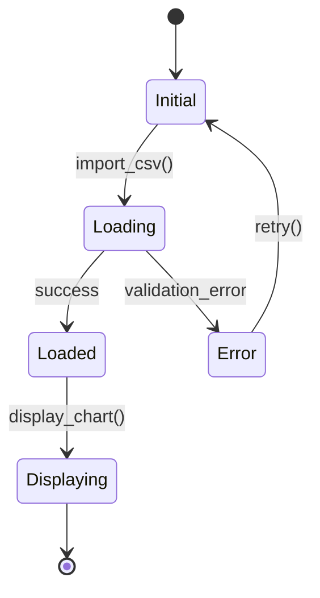
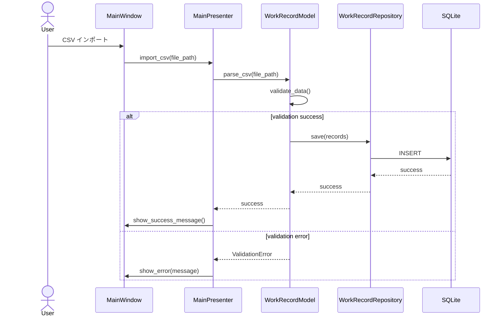

# ソフトウェア設計書 作成プロセス定義書
（02〜06_*-design.md の正式運用ルール）

本書は以下を目的とする。

1. システム設計・アーキテクチャ評価・ADR を前提に **実装へ迷いなく橋渡しできるソフトウェア設計書** を作成する
2. UI / Domain / Infrastructure / Interface / Module の設計を **一貫した粒度と品質** で行う
3. 設計書が **要件 → システム設計 → アーキテクチャ → ADR → ソフトウェア設計 → 実装** の一貫性を担保する
4. レイヤー間の依存・データフロー・テスト容易性を保証する

---

# 0. 固定テンプレート構造（厳守）

**出力先**: `docs/design/02〜06_*-design.md`（UI / Domain / Infrastructure / Interface / Module 設計）

ソフトウェア設計書のテンプレート構造は以下の通りである。

```markdown
# <設計対象名> Design

## 1. Overview（概要）
## 2. Architecture Alignment（アーキテクチャ整合性）
## 3. Design Details（詳細設計）
### 3.1 構造（Structure）
### 3.2 データフロー
### 3.3 振る舞い（Behavior）
## 4. Mapping to Requirements（要件への対応）
## 5. Trade-offs（設計上の判断）
## 6. Risks & Future Considerations（リスクと将来拡張）
## 7. Appendix
```

**絶対遵守事項**:
- **見出し構造（#, ##, ###）は絶対に変更してはならない**
- 見出しの追加・削除・順序変更は禁止
- 内容のみを記入すること

**参照テンプレート**: `手作業/テンプレート/ソフトウェア設計書.md`

---

# 1. プロセス全体フロー（厳守）

1. **前提ドキュメントの精読（要件定義・システム設計・アーキテクチャ評価・ADR）**
2. **設計対象の優先順位づけ（UI / Domain / Infrastructure / Interface / Module）**
3. **【テンプレート 1】 Overview の作成（設計対象の目的・関連要件・関連ADRの明示）**
4. **【テンプレート 2】 Architecture Alignment の確認（ADRとの整合性検証）**
5. **【テンプレート 3】 Design Details の作成（構造・データフロー・振る舞い）**
6. **【テンプレート 4】 Mapping to Requirements の作成（要件への対応確認）**
7. **【テンプレート 5】 Trade-offs の記録（設計上の判断）**
8. **【テンプレート 6】 Risks & Future Considerations の分析（リスクと将来拡張）**
9. **【テンプレート 7】 Appendix の整備（補足図・詳細メモ）**
10. **レビュー（アーキテクト観点 / 実装者観点 / 要件整合性）**

工程を飛ばしてはならない。
特に **Architecture Alignment の手抜きと Mapping to Requirements の漏れは実装時の混乱の主原因**。

---

# 2. 設計対象の優先順位づけ（事前準備）

## 2.1 入力
- `02_system-requirements.md`（要件定義）
- `00_system-design.md`（システム設計）
- `01_architecture-evaluation.md`（アーキテクチャ評価）
- `ADR/ADR-XXX-*.md`（Status: Accepted）

## 2.2 設計書の種類と選定基準

### 設計書の種類
1. **UI 設計** `docs/design/02_ui-design.md`
   - 対象: UI を伴うアプリケーション
   - 内容: 画面構成、画面遷移、状態遷移、イベントハンドリング
2. **ドメイン設計** `docs/design/03_domain-design.md`
   - 対象: 複雑なビジネスルールを含むシステム
   - 内容: エンティティ、値オブジェクト、ドメインサービス、集約
3. **インフラ設計** `docs/design/04_infrastructure-design.md`
   - 対象: 外部データ連携 / DB を含むシステム
   - 内容: リポジトリ、データアクセス層、外部API連携
4. **インターフェース設計** `docs/design/05_interface-design.md`
   - 対象: レイヤード or DDD を採用するシステム
   - 内容: レイヤー間インターフェース、依存方向、抽象化
5. **モジュール設計** `docs/design/06_module-design.md`
   - 対象: 大規模構成のシステム
   - 内容: モジュール分割、パッケージ構成、依存関係

### 選定の基準
- **UI を伴うアプリケーション** → UI 設計を優先
- **複雑なビジネスルール** → ドメイン設計必須
- **外部データ連携 / DB** → インフラ設計必須
- **レイヤード or DDD** → インターフェース設計必須
- **大規模構成** → モジュール設計必須

## 2.3 設計対象の決定

### 手順
1. 要件定義の REQ-F を確認し、主要な機能を列挙
2. アーキテクチャ評価で採用したアーキテクチャを確認
3. ADR で決定された技術選択を確認
4. 上記の選定基準に従い、作成すべき設計書を決定

### 例
```markdown
#### 作成する設計書（優先順位順）
1. **UI 設計**: 画面数 5、MVP パターン採用（ADR-002）
2. **ドメイン設計**: 工数管理ドメイン、DDD Lite 採用（ADR-001）
3. **インフラ設計**: SQLite + Repository パターン（ADR-003）
4. **インターフェース設計**: レイヤー間の依存方向を明確化
```

---

# 3. 【テンプレート 1. Overview】作成プロセス

## 3.1 入力
- 設計対象の範囲（UI / Domain / Infrastructure など）
- 02_system-requirements.md の関連 REQ-F / REQ-NF
- ADR/ADR-XXX-*.md の関連決定

## 3.2 テンプレート構造
```markdown
## 1. Overview（概要）
- 設計対象の目的
- 関連する REQ-ID（機能/非機能）を列挙
- 関連する ADR を列挙
```

## 3.3 作成手順

### 1.1 設計対象の目的
1. この設計書が何を対象とするかを 1〜2 行で明確化
2. **「なぜこの設計が必要か」** を明示

### 1.2 関連する REQ-ID（機能/非機能）を列挙
1. 要件定義の REQ-F / REQ-NF から、この設計に関連するものをすべて抽出
2. 表形式で列挙

**記述例**:
```markdown
| REQ-ID | 要件概要 |
|--------|----------|
| REQ-F-001 | CSV インポート機能 |
| REQ-F-005 | チャート表示機能 |
| REQ-NF-001 | 応答時間 3 秒以内 |
```

### 1.3 関連する ADR を列挙
1. ADR ディレクトリから、この設計に影響する ADR をすべて抽出
2. ADR の決定内容を簡潔に要約

**記述例**:
```markdown
| ADR-ID | 決定内容 |
|--------|---------|
| ADR-001 | レイヤードアーキテクチャ採用 |
| ADR-002 | UI パターンとして MVP 採用 |
| ADR-003 | SQLite をデータストアとして採用 |
```

## 3.4 禁止事項
- ADR と矛盾する内容を書く
- 要件定義にない機能を追加する
- 設計対象の範囲を超えた内容を書く

---

# 4. 【テンプレート 2. Architecture Alignment】確認プロセス

## 4.1 入力
- `01_architecture-evaluation.md`（アーキテクチャ評価）
- `ADR/ADR-XXX-*.md`（関連 ADR）

## 4.2 テンプレート構造
```markdown
## 2. Architecture Alignment（アーキテクチャ整合性）
- 関連 ADR の要点を要約し、今回の設計への影響を 3〜6 行で記述
- 禁止事項／制約／依存方向（Layered / MVVM / Repository）などを明記
- 02_system-requirements の制約との整合性を明示
```

## 4.3 作成手順

### 2.1 関連 ADR の要点を要約
1. 関連 ADR を読み、今回の設計への影響を 3〜6 行で記述
2. **禁止事項・制約・依存方向** を明確にする

**記述例**:
```markdown
#### ADR-001: レイヤードアーキテクチャ
- Presentation / Application / Domain / Infrastructure の 4 層構成
- **依存方向**: Presentation → Application → Domain ← Infrastructure
- **禁止**: Domain 層から Infrastructure 層への直接依存

#### ADR-002: UI パターンとして MVP 採用
- Model / View / Presenter に分離
- **View は Presenter に依存し、Model には直接依存しない**
- **Presenter がテスト可能な単位となる**
```

### 2.2 02_system-requirements の制約との整合性
1. システム要件の制約を確認
2. 設計がその制約を満たしているかを明示

## 4.4 禁止事項
- ADR の決定内容を無視する
- レイヤー依存ルールを破る
- 制約を満たさない設計を行う

---

# 5. 【テンプレート 3. Design Details】作成プロセス

## 5.1 入力
- 設計対象の範囲（UI / Domain / Infrastructure など）
- Architecture Alignment（アーキテクチャ整合性）
- 関連 REQ-F / REQ-NF

## 5.2 テンプレート構造
```markdown
## 3. Design Details（詳細設計）
設計対象に応じて次を含める：

### 3.1 構造（Structure）
- クラス構成図（Mermaid OK）
- レイヤー配置
- 使用するデザインパターン（MVVM、Repository、Service など）

### 3.2 データフロー
- 入力 → 処理 → 出力
- 状態遷移
- 外部要素（CSV, API, DB）との関係

### 3.3 振る舞い（Behavior）
- 主要ユースケースのシーケンス図（Mermaid）
- 例外処理方針
- エラー時の UI / Domain の振る舞い
```

---

## 5.3 【3.1 構造（Structure）】の作成プロセス

### クラス構成図の作成
1. **Mermaid classDiagram を使用**（推奨）
2. クラス名、属性、メソッドを明示
3. クラス間の関係（継承、実装、関連、依存）を矢印で表現

### レイヤー配置の明示
1. 各クラスがどのレイヤーに属するかを明確化
2. レイヤー間の依存方向を確認

### デザインパターンの適用
1. 使用するデザインパターンを明示（MVVM、Repository、Service、Factory など）
2. パターンの適用理由を記述

### 記述例（Mermaid）


---

## 5.4 【3.2 データフロー】の作成プロセス

### 入力 → 処理 → 出力
1. 主要なユースケースについて、データの流れを記述
2. **各レイヤーでのデータ変換** を明示

### 状態遷移
1. 状態を持つオブジェクトについて、状態遷移図を作成
2. **Mermaid stateDiagram を使用**（推奨）

### 外部要素（CSV, API, DB）との関係
1. 外部要素とのデータ授受を明示
2. **データフォーマット変換** を記述

### 記述例（Mermaid）


---

## 5.5 【3.3 振る舞い（Behavior）】の作成プロセス

### 主要ユースケースのシーケンス図
1. **Mermaid sequenceDiagram を使用**（推奨）
2. オブジェクト間のメッセージパッシングを明示
3. **非同期処理、エラーハンドリング** を記述

### 例外処理方針
1. 各レイヤーでの例外処理方針を明示
2. **例外の伝播方向** を記述

### エラー時の UI / Domain の振る舞い
1. エラー発生時の UI 表示方針
2. ドメイン層でのエラーハンドリング

### 記述例（Mermaid）


---

# 6. 【テンプレート 4. Mapping to Requirements】作成プロセス

## 6.1 入力
- 02_system-requirements.md の関連 REQ-F / REQ-NF
- Design Details（詳細設計）

## 6.2 テンプレート構造
```markdown
## 4. Mapping to Requirements（要件への対応）
- 必要な REQ-F / REQ-NF の一覧を表形式で列挙
- どの設計要素がどの要件を満たすかを記述
- 未対応の REQ があれば警告を出す
```

## 6.3 対応マトリクスの作成

### 記述形式
| 設計要素 | 対応する REQ | 説明 |
|---------|--------------|-------|
| ImportService | REQ-F-002 | CSV 読み込み機能 |
| ChartViewModel | REQ-F-005 | チャート描画ロジック |
| WorkRecordRepository | REQ-NF-003 | データ永続化 |

### トレーサビリティの保証
1. **すべての REQ-F / REQ-NF が少なくとも 1 つの設計要素に対応している**
2. **対応していない要件は「未対応」として明示**
3. **未対応の理由を記述**（将来対応、他の設計書で対応、技術的制約など）

## 6.4 禁止事項
- 要件定義にない機能を設計に追加する
- 要件と設計の対応が曖昧なまま残す

---

# 7. 【テンプレート 5. Trade-offs】記録プロセス

## 7.1 入力
- Design Details（詳細設計）
- ADR には書ききれないレベルでの詳細判断

## 7.2 テンプレート構造
```markdown
## 5. Trade-offs（設計上の判断）
- ADR には書ききれないレベルでの詳細判断
- 選択肢 A/B/C とその理由を簡潔に記述
- 今回の設計決定の根拠を明確にする
```

## 7.3 記述すべき内容

### 選択肢 A/B/C とその理由
1. 設計上の複数の選択肢を明示
2. 選択した理由を簡潔に記述

### 今回の設計決定の根拠
1. **なぜこの設計を選んだか** を明確にする
2. パフォーマンス、保守性、テスト容易性などの観点で評価

### 記述例
```markdown
#### データバインディング方式の選択
- **選択肢A**: Qt の Signal/Slot を使用
- **選択肢B**: Observer パターンを自前実装
- **選択肢C**: データバインディングライブラリを導入

**選択**: 選択肢A（Qt の Signal/Slot）
**理由**:
- Qt フレームワークのネイティブ機能であり、学習コストが低い
- パフォーマンスが良好
- テスト時のモック化が容易
```

---

# 8. 【テンプレート 6. Risks & Future Considerations】分析プロセス

## 8.1 入力
- Design Details（詳細設計）
- ADR のリスク分析

## 8.2 テンプレート構造
```markdown
## 6. Risks & Future Considerations（リスクと将来拡張）
- この設計のリスク（保守性・性能・依存）
- 将来の変更時に影響が出る箇所
- ADR を再評価するべきトリガー
```

## 8.3 この設計のリスク

### 抽出すべきリスク
| リスクカテゴリ | 例 |
|---------------|-----|
| 保守性 | クラス間の密結合、循環依存 |
| 性能 | N+1 問題、メモリリーク |
| 依存 | 外部ライブラリへの過度な依存 |
| テスト容易性 | モック化困難、テストケースの爆発 |
| 拡張性 | 機能追加時の影響範囲が広い |

### 記述例
```markdown
#### この設計のリスク
1. **保守性**: Presenter が肥大化しやすい
   - **軽減策**: Presenter を機能ごとに分割、UseCase パターンの導入
2. **性能**: チャート描画時のメモリ使用量
   - **軽減策**: データの遅延ロード、メモリプロファイリング
```

## 8.4 将来の変更時に影響が出る箇所

### 記述すべき項目
- データ構造の変更が影響する範囲
- 外部API仕様の変更が影響する範囲
- UIフレームワークの変更が影響する範囲

### 記述例
```markdown
#### 将来の変更時に影響が出る箇所
1. **データ構造の変更**: WorkRecord エンティティの変更時、以下が影響を受ける
   - WorkRecordRepository（データアクセス層）
   - WorkRecordMapper（DTO ⇔ Entity 変換）
   - ChartViewModel（表示用データ変換）
2. **UIフレームワークの変更**: PySide6 から PyQt6 への移行時、以下が影響を受ける
   - すべての View クラス
   - Signal/Slot の実装
```

## 8.5 ADR を再評価するべきトリガー

### 記述すべき項目
- どのような変更要求が来たらアーキテクチャを再評価すべきか
- 技術的負債が溜まった場合の判断基準

### 記述例
```markdown
#### ADR を再評価するべきトリガー
1. **マルチユーザー対応**: SQLite では対応困難、PostgreSQL への移行を検討
2. **リアルタイム同期**: 現在のアーキテクチャでは困難、イベント駆動への移行を検討
3. **大量データ処理**: 10万件以上のデータ処理が必要になった場合、バッチ処理の導入を検討
```

---

# 9. 【テンプレート 7. Appendix】整備プロセス

## 9.1 テンプレート構造
```markdown
## 7. Appendix
- 補足図
- 詳細メモ
- 必要に応じて仕様参照
```

## 9.2 記述すべき内容
- 本文に入りきらなかった詳細図（ER図、パッケージ図など）
- 設計判断の補足メモ
- 外部仕様書・ライブラリドキュメントへの参照リンク

---

# 10. レビュー手順

## 10.1 アーキテクト観点レビュー
- ADR との整合性が保たれているか
- レイヤー依存ルールが守られているか
- デザインパターンの適用が妥当か

## 10.2 実装者観点レビュー
- クラス名・メソッド名が具体的か
- データフロー・状態遷移が明確か
- エラー処理・異常系が考慮されているか

## 10.3 要件整合性レビュー
- すべての REQ-F / REQ-NF が設計に反映されているか
- 未対応要件の理由が明確か
- トレーサビリティが保証されているか

---

# 11. 最終チェックリスト（必須）

- [ ] **テンプレート構造が厳守されているか**（見出し構造の変更・削除・追加がないか）
- [ ] すべての REQ-F / REQ-NF がどこかの設計要素に紐付いているか
- [ ] ADR の Decision と矛盾する設計が存在しないか
- [ ] クラス / メソッド / API 名が具体的に記載されているか
- [ ] データフロー・状態遷移・インターフェースの図（Mermaid 等）が揃っているか
- [ ] エラー処理・異常系・受入条件がテスト観点まで落ちているか
- [ ] レイヤー間の依存方向が明確か
- [ ] モジュール分離が適切か
- [ ] テスト容易性が考慮されているか

---

# 付録：作業の入力

```
docs/requirements/02_system-requirements.md
docs/design/00_system-design.md
docs/design/01_architecture-evaluation.md
ADR/ADR-XXX-*.md
```

---

# まとめ（重要ポイント）

- ソフトウェア設計は **システム設計・アーキテクチャ評価・ADR を前提** に行う
- **テンプレート構造を厳守** し、見出し構造を変更しない
- **Architecture Alignment** を必ず確認し、ADR との整合性を保証する
- **Mapping to Requirements** でトレーサビリティを保証し、すべての要件が設計に反映されていることを確認する
- **Trade-offs と Risks** を記録し、将来の変更時の判断材料とする
- 設計書は **実装の指示書** であり、コードそのものではない。適切な粒度を保つ
- **レイヤー間の依存・データフロー・テスト容易性** を常に意識する
